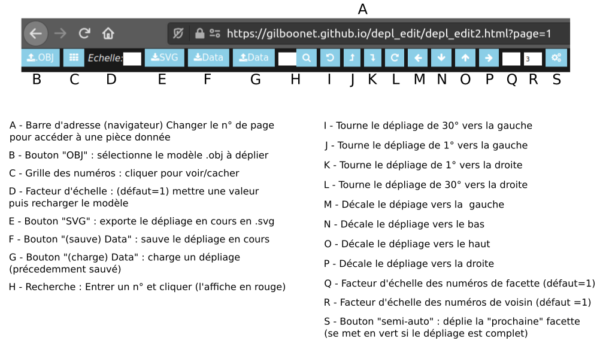

# Editeur graphique de gabarit de dépliage
depl_edit est une application html/js qui permet de créer le gabarit/plan d'un volume de façon semi-automatique à l'aide d'une interface graphique.

## Interface

## Volume
Le volume doit être au format .obj triangularisé. Wings 3d peut être utilisé pour le convertir à ce format si besoin.
La dimension du gabarit correspondra à une unité pour 1 mm. L'export de Wings3d possède une option d'échelle d'exportation si besoin, sinon le paramètre "Echelle" peut être modifié (recharger le volume après l'avoir modifié pour qu'il soit pris en compte).

## Volume en une pièce
Un volume simple peut être déplié en une seule pièce
Un dépliage simple s'effectue ainsi:

- sélection

## Mode semi-automatique

## Coloriage de zones à déplier séparément
