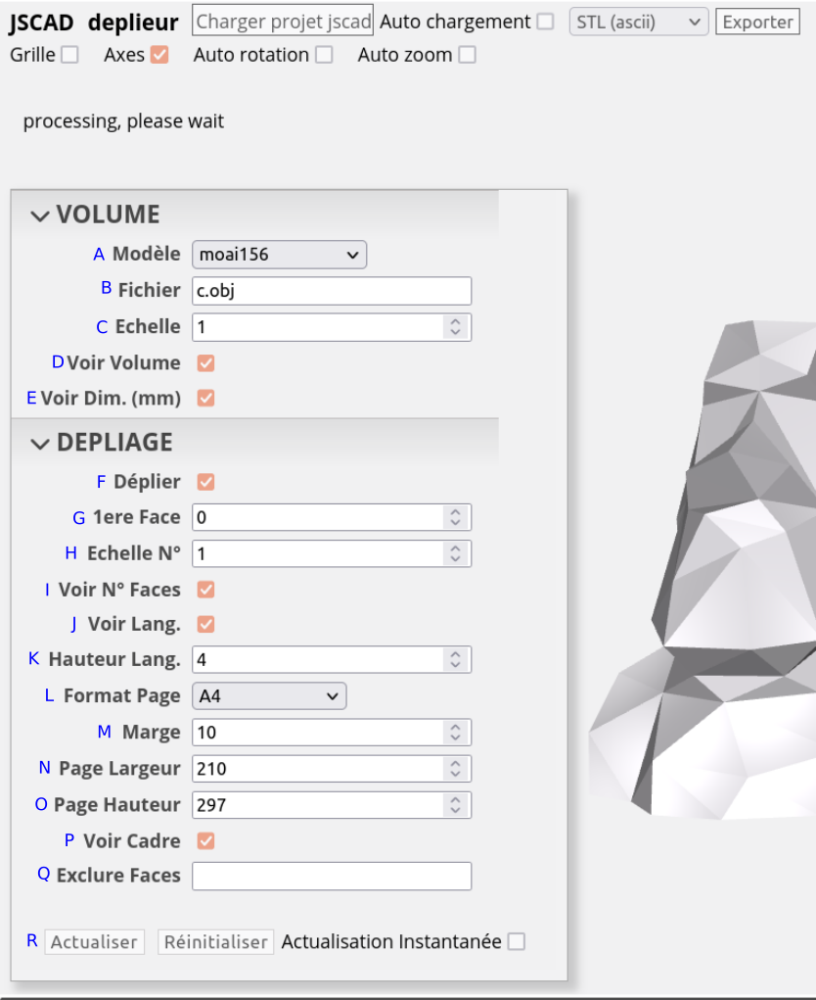

**DEPLIEUR** est un script pour OpenJSCAD (v2) permettant de déplier un volume afin d'en faire une version en papier ou carton.

**INSTALLATION** :
- récupérez l'archive [ici](deplieur.zip)
- décompressez la dans un dossier
- ouvrez https://openjscad.xyz
- cliquez sur "Charger Projet" et accédez au dossier

**REMARQUES** :
- Il accepte les fichiers 3d au format .OBJ ou .STL (choisir "Fichier... dans la liste)
- Pour pouvoir exporter en 2D (.DXF de préférence, ou .STL) il faut décocher "Voir Volume"
- Décocher "Actualisation Instantanée" si vous avez une machine peu puissante (cliquer sur "Actualiser" pour lancer un rendu)
- De trop petits modèles peuvent empêcher le calcul (agrandir l'échelle)
- Certaines languettes peuvent être manquantes (si elles sont très proches mais ne se touchent pas)

- A) **Modèle** : Choix du modèle (si fichier... voir B)
- B) **Fichier** : Zone de saisie du fichier (.obj ou .stl)
- C) **Echelle** : 1 par défaut (< 1 pour rétrécir, > 1 pour agrandir)
- D) **Voir Volume** : Cocher pour afficher le modèle choisi
- E) **Voir Dim (mm)** : Cocher pour afficher les dimensions
- F) **Déplier** : cocher pour calculer et afficher le dépliage
- G) **1ere Face** : 0 par défaut
- H) **Echelle N°** : 1 par défaut
- I) **Voir N° Faces** : Utile pour choisir des faces à exclure (voir Q)
- J) **Voir Lang.** : Cocher pour calculer et afficher les languettes
- K) ** Hauteur Lang.** : 4 (mm) par défaut
- L) **Format Page** : Choix du format de page (si personnalisé... voir N et O)
- M) **Marge** : 10 (mm) par défaut
- N) **Page Largeur** : 210 (mm) par défaut
- O) **Page Hauteur** : 297 (mm) par défaut
- P) **Voir Cadre** : Cocher pour afficher un cadre autour des pages
- Q) **Exclure Faces** : Entrer des paires (face-voisin) pour exclure des chemins de dépliage
- R) **Actualiser** : Cliquer pour lancer le rendu
